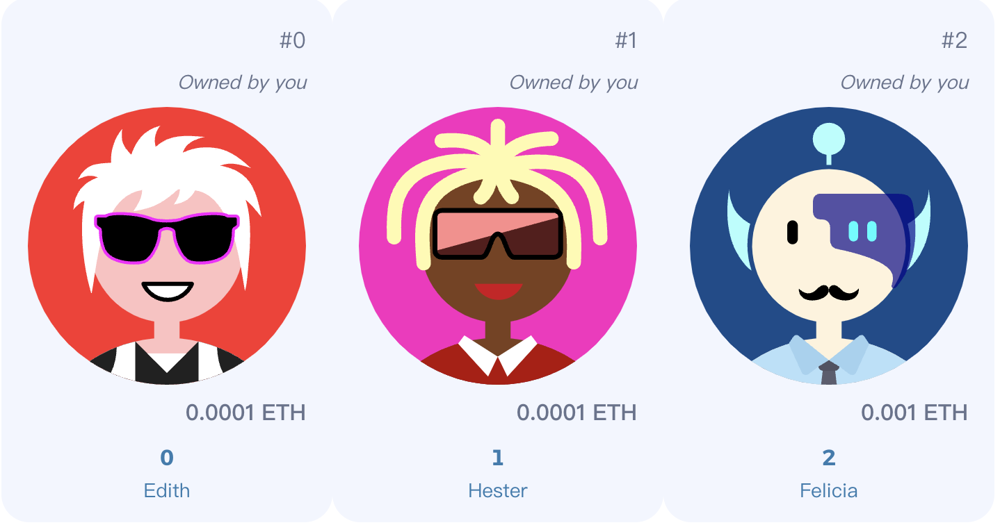

# Just Avatar


<br/>
<p align="center">

</a>
</p>
<br/>

>  *All the avatar images come from [multiavatar](https://multiavatar.com/)  and used under it's [license](https://github.com/multiavatar/Multiavatar/blob/main/LICENSE).*

This is a repo contains all infomation about Just Avatar contracts.

- [Just Avatar](#just-avatar)
- [Getting Started](#getting-started)
  - [Requirements](#requirements)
  - [Quickstart](#quickstart)
- [Usage](#usage)
- [Thank you!](#thank-you)


# Getting Started

## Requirements

- [git](https://git-scm.com/book/en/v2/Getting-Started-Installing-Git)
  - You'll know you did it right if you can run `git --version` and you see a response like `git version x.x.x`
- [Nodejs](https://nodejs.org/en/)
  - You'll know you've installed nodejs right if you can run:
    - `node --version` and get an ouput like: `vx.x.x`
- [Yarn](https://classic.yarnpkg.com/lang/en/docs/install/) instead of `npm`
  - You'll know you've installed yarn right if you can run:
    - `yarn --version` and get an output like: `x.x.x`


## Quickstart

```bash
git clone https://github.com/psyljz/just-avatar-contract
cd just-avatar-contract
yarn
```

# Usage

1. Setup environment variabltes

You'll want to set your `GOERLI_RPC_URL` and `PRIVATE_KEY` as environment variables. You can add them to a `.env` file, similar to what you see in `.env.example`.

- `PRIVATE_KEY`: The private key of your account (like from [metamask](https://metamask.io/)). **NOTE:** FOR DEVELOPMENT, PLEASE USE A KEY THAT DOESN'T HAVE ANY REAL FUNDS ASSOCIATED WITH IT.
  - You can [learn how to export it here](https://metamask.zendesk.com/hc/en-us/articles/360015289632-How-to-Export-an-Account-Private-Key).
- `GORL_RPC_URL`: This is url of the goerli testnet node you're working with. You can get setup with one for free from [Alchemy](https://alchemy.com/?r=0ede4fdf6cd368f9).
- `ETHERSCAN_API_KEY`:This is API KEY of etherscan to verify your contract. You can get setup with one for free from [Etherscan](https://etherscan.io/myapikey).

1. Get testnet ETH

Head over to [faucets.Alchemy](https://goerlifaucet.com/) and get some tesnet ETH. You should see the ETH show up in your metamask.

2. Deploy

```bash
yarn hardhat deploy --network gorl
```

3. Mint three Nft:

```bash
yarn hardhat run scripts/mint_nft.js --network gorl
```


# Thank you!

If you appreciated this, feel free to give a star and follow me on Twitter !

[](https://twitter.com/ljzbtc)

